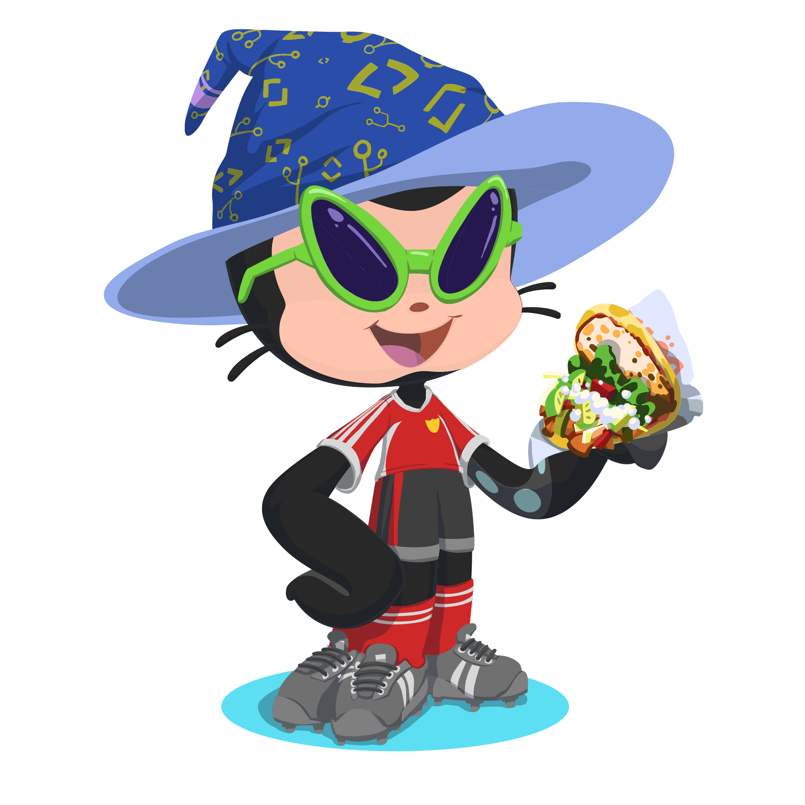

# Hello there!! Im not General Kenobi though 👋

My name is Sergio Misas (he/him) and I am currently studing a Multiplatform Application Development professional training at [IES-LUIS-VIVES](https://www.iesluisvives.es/).

Not only am I studying this, but I also have spent 4 years studying a chemistry degree at [UCM](https://quimicas.ucm.es/), but I switched to the former degree.

And last but not least I have achieved the [C2 Cambridge English certificate](https://www.instagram.com/p/CKv6-AMFcTc/) on September of 2020 (I received my certificate later).

I will upload all my proyects, exercises and exams here so you can take a look.

## Tools and languages I develop with

These are the ones I am currently using:

## My socials 📫

 

 
 
 

## More about me

I am a huge football fan ⚽, drinking iced tea with my friends while watching a match is one of the most enjoyable activities 🍹 for me.

Apart from that I am a huge nerd that loves to play D&D 🪄 🏹 ⚔️ and many types of videogames 🎮 such as FIFA, Minecraft, Divinity Original Sin 2, Apex Legends.... 

You can join me if you want!!! 😃

I also like almost any kind of music genre so I guess I am pretty polyvalent 😄

<!--
**SergioMisas/SergioMisas** is a ✨ _special_ ✨ repository because its `README.md` (this file) appears on your GitHub profile.

Here are some ideas to get you started:

- 🔭 I’m currently working on ...
- 🌱 I’m currently learning ...
- 👯 I’m looking to collaborate on ...
- 🤔 I’m looking for help with ...
- 💬 Ask me about ...
- 📫 How to reach me: ...
- 😄 Pronouns: ...
- ⚡ Fun fact: ...
-->
